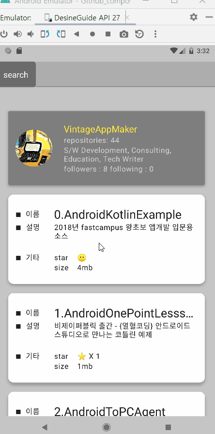

# Github compose
> Jetpack compose를 이용한 Github api 예제
> Jetpack compose의 빠른 활용이 목적인 예제

Jetpack compose는 선언형 UI 구조와 상태관리를 이해해야 사용가능한 프레임웍이다. 그러다보니 기존 Android 개발구조와는 많은 상이함을 가지고 있다. 특히 화면단위의 Lifecycle을 compose만의 방법으로 처리해야 하는 이슈가 발생한다.

1. 사용하다 경험한 이슈
   - 기존 XML에서 구현했던 다양한 기법들이 compose에서는 기본적인 것부터 검색하게 된다 <= 바로 시작할 프로젝트에서는 compose는 금물인 이유이다.
   - "Text size가 sp를 강제한다." <= sp의 경우, 사용자가 시스템 폰트를 변경하면 따라서 변경된다.
   - "Fragment, Activity의 lifecycle을 적용하기 애매하다." <= 레퍼런스 찾기기 쉽지않다
   - preview 기능을 구현하려면 "코딩수준"의 관리가 필요하다. <= 편한 것인지 불편한 것인지 판단하기 힘들다.
   - @OptIn(ExperimentalMaterialApi::class)를 사용할 때가 많다. 코드에 대한 확신이 떨어진다.  <= 아직은 실험수준의 코드가 많다.

2. 사용하다 경험한 좋은 점
   - 재미있게 생겼다.
   - 레퍼런스가 쌓이면 코드량이 현격히 줄어들 것이 예상된다(특히  RecyclerView, ListView를 LazyColumn으로 대체하여 개발할 시 대단한 만족감을 얻게된다)
   - compose가 멀티플랫폼 지원을 목표하고 있다. Flutter와 비슷한 행보를 가고 있다.

3. 현재시점(공식릴리즈 1년이 안된 시점)의 활용법
   - ASAP으로 진행해야 하는 프로젝트라면 compose만으로 개발은 바람직하지 못하다.
   - Activity + Fragment 뼈대 위에 setContent()내에서 compose를 활용하는 것이 안전하다.
   - 가끔 서든파티 모듈(ex: 지도서비스)을 사용한다면 속편하게 compose 내에서 AndroidView를 사용하는 것을 추천한다
   - MVVM 사고방식을 기반으로
     - Observer와 Sender에 친숙한 코드를 작성하는 버릇을 키워야 한다.
     - ViewModel에서 Data를 관리하며 coroutine, flow 관련함수 예제를 적극활용한다.
